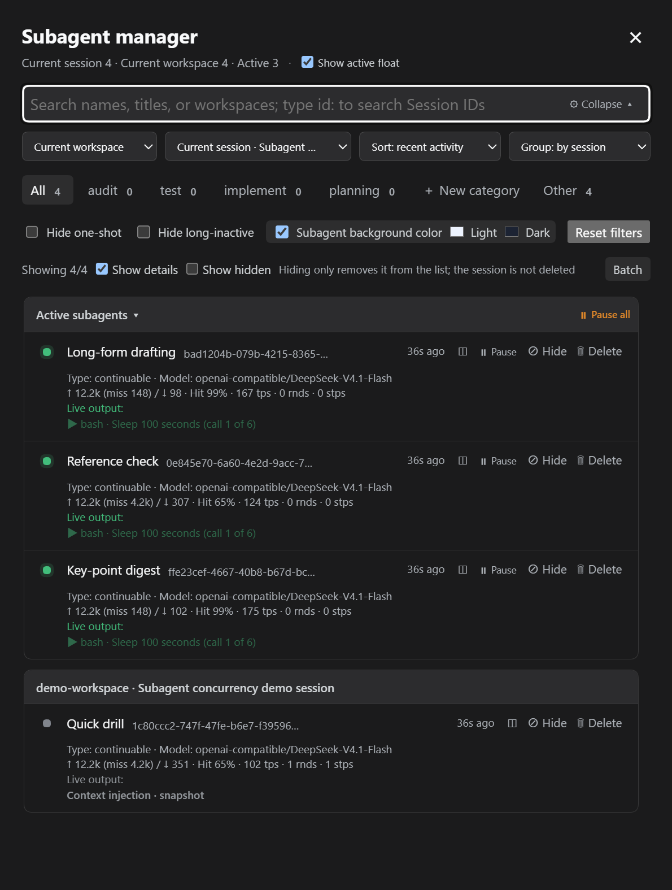
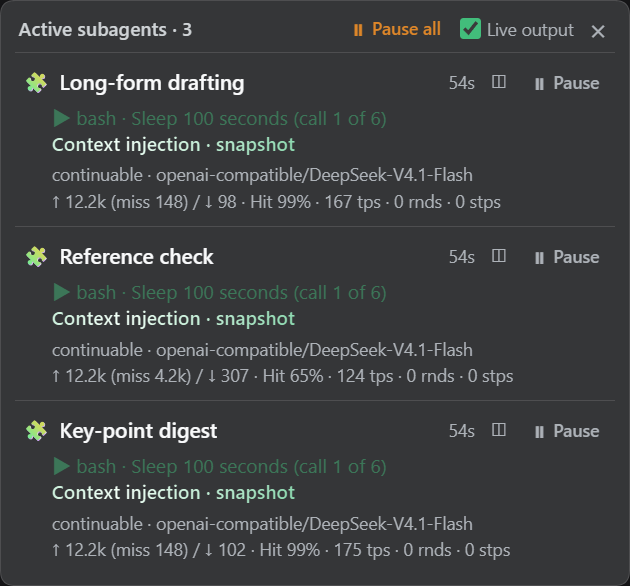

# DSH Subagent Workspace UI

A Web client plugin that adds a **子代理管理** button to the conversation-header action row. It opens a searchable panel for the subagents currently discovered by the DSH client runtime.

## Features

- Compact title-bar trigger shows the active-child count and animated activity dot without opening the panel.
- Defaults to the main session's current workspace and current session, even when the user is viewing a child session.
- Workspace and session selectors support current workspace, all workspaces, named workspaces, current session, and named sessions.
- Sort by recent activity, name, or type; recently running children remain near the top after they finish.
- Group by session, workspace, category, type, or no grouping. Session headers show the workspace and parent session name.
- Browser-local classification tabs support custom regular expressions. Built-ins include all, other, review, test, implementation, and planning.
- One-shot children carry a compact `⚡ 一次性` badge; continuable children remain visually uncluttered.
- Show each child's current **type and model provider/id** (`provider/model`, plus the reasoning effort when the host publishes one) from the host's public projections only — no new RPC, no model-switch UI. See [Type and model](#type-and-model-read-only-projections).
- Show each child's usage inline, computed with the host's own definitions: `↑ 131.3k (未缓存 39.1k) / ↓ 12.7k · 命中 70% · 104 tps · 3 轮 · 9 步` (English UI: `miss` / `Hit` / `rnds` / `stps`). The `↑` figure is the **billed input** (`uncachedInputTokens + cacheReadTokens + cacheWriteTokens`) and that billed input alone is the cache-hit denominator — exactly what DSH's own composer footer does, so the plugin and the host agree instead of disagreeing by six points. `tps` is `decodeTokens / (decodeMs / 1000)` from the same public `sessionStats` projection. Hovering the row or the floating panel reveals the complete breakdown — total, every bucket, the share, the speed, and the session's LLM / tool / TTFT timings — in the native `title` tooltip.
- Archive state is local and never deletes a DSH session. Single-row archive actions and a batch mode support shift-selection, select-all, time-based selection (up to 1,000 rows), batch archive, restore, and archive-all.
- Load catalogs in pages of 40 with an independent wheel-scroll container; batch time selection expands loading up to 1,000 children.
- Batch mode changes cards into selection targets and hides individual archive/restore actions. The highlighted 完成 button exits batch mode.
- Open a loaded child at its exact `{ parentSessionId, childSessionId, mode }` address. In normal mode the whole card opens the child; archive controls do not.
- Every row also carries a dedicated **open in the sidebar** button (`◫`) that opens the child as a right-sidebar tab, so the main conversation stays where it is. The button stops propagation (it never triggers the row's default navigation and never toggles batch selection), and it is rendered only when the runtime exposes the sidebar capability: without `ctx.sidebarRight` plus a type that claims the address, the button is hidden entirely; for a single row whose subagent address cannot be resolved it stays visible but disabled with a readable reason. The same button is on the active-subagent floating panel.
- Show session IDs beside names, compact metadata, token totals, and creation time in the relative-time tooltip.
- Active children are grouped at the top in a collapsible section. The panel shows the latest two lines of live output, recent tool calls, context injection, command status, and a gray final snapshot after completion — for **every** running row, not only the selected child, because the plugin retains its own session binding instead of borrowing whatever the main view happens to hold.

## Screenshot guide

Both screenshots were taken on the `1.7.0-dev` line (commit `79d9d0f`) against a real dsh **0.1.6-alpha.2** instance in its dark theme. The session had four background subagents at once — three still running and one already finished — so every row could be shown with its real type, model and usage figures. The pair below is the English UI; the Chinese UI pair is in [`README.zh.md`](README.zh.md).





1. **Header** — panel title, `Current session n · Current workspace n · Active n`, the show-active-float toggle, and the close action.
2. **Search and scope row** — ordinary name/title/workspace search, with `id: xxx` reserved for Session ID search; workspace, session, sorting, and grouping selectors stay on one compact row.
3. **Classification row** — built-in and custom categories with live counts, custom-category creation and deletion inside the same tab frame.
4. **Filter row** — hide one-shot, hide long-inactive, subagent background colour (light/dark), and reset filters.
5. **Summary row** — `Showing n/m`, show details, show hidden, and the batch-mode entry.
6. **Active subagents group** — pinned to the top and collapsible, with `Pause all`; each row carries the activity dot, the name, the Session ID, the relative activity time, and the `◫` open-in-the-sidebar, `⏸ Pause`, `⊘ Hide` and `🗑 Delete` actions.
7. **Detail block** — `Type: … · Model: …` straight from the host's read-only projections, then the official usage line `↑ billed (miss …) / ↓ output · Hit n% · n tps · n rnds · n stps`; a running child also shows its latest live-output lines, while a finished child keeps its final snapshot.
8. **Floating panel** — the running children of the current session in a compact always-on-top card, each with its live output, usage line and stop button; it appears whenever at least one child is running and the manager panel is closed. While it is shown it keeps every running child it lists live, independently of which child the main view has selected.

## Install in the Web profile

From this directory:

```bash
dsh plugin --profile web add file:.
```

The bundle includes [`cordis.patch.yml`](cordis.patch.yml), which inserts the manager and shadows exactly one stock slot: `conversation.session.header.lineage` is claimed by a `priority: -1` title-only shadow so DSH's stock `ui-subagent` lineage dropdown stays invisible while this package is installed. The stock `ui-subagent` plugin itself is **left enabled** — this package no longer disables it wholesale, because the sidebar tab it provides is the navigation target of the new "open in the sidebar" button. The shadow renders the session title instead of an empty entry, so the subagent session header keeps its title. Removing the package removes this bundle layer, and the host's `ui-subagent` setting is untouched, so your own configuration is restored as it was. Restart the existing `dsh web` process, then refresh `http://127.0.0.1:3080` after the plugin is available.

If you previously disabled `ui-subagent` manually in `$DSH_HOME/profiles/web/cordis.patch.yml`, you can keep that stanza: it is user-owned and intentionally preserved. The plugin no longer needs (or writes) such a stanza.

## Runtime data boundary

The public DSH Web session store exposes subagent summaries that have been discovered in the current browser runtime. It deliberately does not expose a global historical subagent index or a mode for every unvisited child. Therefore this first plugin version manages the discovered catalog; rows whose type is not yet loaded remain visible and searchable and fall back to DSH's retained session navigation. Exact catalog navigation is used automatically as soon as DSH supplies the address and mode.

A full persistent workspace-wide archive view requires a host-side catalog RPC (or an upstream DSH API) that enumerates every child address and its mode. The public `SessionSummary` does not expose the original prompt, so prompts are neither queried nor displayed; **type and model** come from the public projections documented in [Type and model](#type-and-model-read-only-projections). Live output and tool/context activity are read from a bound session automatically: on dsh **0.1.2-alpha.2** they are derived from the raw `binding.eventSource` event stream (showing the tool description or target filename), while older hosts (e.g. **0.1.1-rc.2**) fall back to `session.getSnapshot().chat.legacy`. On hosts with the retain contract (**0.1.6-alpha.2** and on) the plugin first **retains** each running child itself — `sessions.binding(id)` merely borrows a binding somebody else retained, so without retaining, only the child the main view had selected ever streamed. Retention is bounded to 8 children (the float first, then the panel's rendered running rows, most recently active first) and is released as soon as a row stops rendering or stops running, when a surface closes, or when the plugin is disposed; a child beyond the cap, and any host without `retain`, falls back to the borrowed binding and then to the durable summary. Capability detection selects the path (never a version check), so the plugin stays forward compatible. The UI is isolated in [`lib/client.js`](lib/client.js), so it can switch to a richer source without changing the panel interaction model.

### Type and model (read-only projections)

A child's type and model come from public host projections. The plugin adds no RPC and writes no state:

```text
# type: one reader, read-only catalog and identity rungs, resolved in this order
ctx.sessions.list.getSnapshot().subagentsByParent[parentId].entries           # dsh ..0.1.6-alpha.2
→ entry.mode                       # rung 1: discovered catalog entry (present once that parent's catalog was pulled)
ctx.sessions.list.getSnapshot().byId[parentId].projectionValues.subagentCatalog   # dsh 0.1.7-rc.1..
→ entry.mode                       # rung 1': the parent's own catalog projection (same direct children, catalog event order)
ctx.sessions.list.getSnapshot().byId[childId].projectionValues.subagent
→ { mode, label, seq } | null      # rung 2: the child's own identity projection (pushed on the live-control stream)
→ displayed value = rung 1 ?? rung 1' ?? rung 2   # all silent = the existing `typeLoading` text

# model: the session projection modelSelection (probed by key; unreadable = the host does not publish it)
ctx.sessions.list.getSnapshot().byId[childId].projectionValues.modelSelection
→ { lastUsed, next }               # next = pending selection ?? lastUsed
→ displayed value = next ?? lastUsed   # { provider, model, reasoningEffort? }
```

The display rules are identical on all three surfaces and differ only in density:

| Surface | Rendering |
| --- | --- |
| List-row meta line | no model (unchanged: relative time and summary stats) |
| Card detail row (expanded by default) | `Type: continuable · Model: newapi-test/DeepSeek-V4.1-Flash · high` |
| Active-subagent float | compact: `continuable · newapi-test/DeepSeek-V4.1-Flash · high` |

- `reasoningEffort` is appended **only when the host supplies it** (` · high`); no placeholder is rendered otherwise.
- All three surfaces share one `modelText()` reader, so the source, the precedence (`next ?? lastUsed`), and the fallback are the same everywhere; the float only drops the field labels.
- The type is resolved by one reader (`childModeOf`) with one fallback order, shared by the detail row, the row badge and the float: the discovered catalog entry first, then the child's own `subagent` identity projection. The catalog itself has two generations — `subagentsByParent[parentId].entries` up to **0.1.6-alpha.2**, and the parent session's own `projectionValues.subagentCatalog` from **0.1.7-rc.1** on (with `projectionsBySession[parentId].values.subagentCatalog` as a defensive fallback) — and the legacy source wins whenever a host publishes both, so an older host reads exactly what it read before. Rung 2 is what makes the type correct on a freshly loaded page **without** opening the manager panel — the host pushes that projection on the live-control stream and on every session-added summary, while rung 1 only arrives when a parent's catalog is pulled (opening the panel is one such pull). Both rungs silent keeps the existing fallback: the panel and the float show **type loading…** (`类型待加载` in Chinese), never a blank or a `null`.
- When the host does not publish the projection (e.g. **0.1.1-rc.2**), when the projection value is empty, or when provider/model is an empty string, the plugin shows the explicit fallback **model unknown** (`模型未知` in Chinese) instead of a blank or `null/null`. That fallback has its own i18n key (`modelUnknown`) and never reuses `typeLoading`: on an old host the two fields degrade independently (observed row: `Type: type loading… · Model: model unknown`).
- **Read-only, no switching**: the plugin calls no model write API such as `selectedModel` and offers no model-switch UI; the official SDK marks model selection as unavailable for addressed subagent sessions (`model selection is unavailable for addressed subagent sessions`).

## Compatibility

v1.8.0 supports dsh **0.1.6-alpha.2** and **0.1.7-rc.1** and stays backward compatible with all DeepSeek Harness versions. Those two hosts differ in the API surface this plugin reads: 0.1.7-rc.1 **removed** `sessions.setSubagentCatalogOpen`, **renamed** `refreshSubagents(parentSessionId)` to `refreshProjections(sessionId)`, and **replaced** `SessionListState.subagentsByParent` with the parent session's own `subagentCatalog` projection. Every call site probes for the capability it needs, so both generations work and no version number is ever compared. Opening a subagent session is capability-detected at runtime and degrades in three tiers:

```text
# dsh 0.1.2-alpha.5 .. 0.1.6-alpha.1: the session controller entry points
ctx.sessions.openSubagent(address)   # exact child address
ctx.sessions.open(sessionId)         # retained session navigation

# dsh 0.1.6-alpha.2 and later: the workspace navigation service
ctx.get('uiWorkspace').openSession({ parentSessionId, childSessionId, mode } | sessionId)

# neither is available: the click reports that the host has no session navigation API
```

`uiWorkspace` is read through `ctx.get('uiWorkspace')`, never through a required injection, so hosts that do not register the service (everything before **0.1.2-alpha.5**) still load and keep using the session-controller path, while hosts that removed `openSubagent`/`open` (**0.1.6-alpha.2**) use the workspace service. **The probe order follows the argument shape, not the version**: `sessions.openSubagent` accepts an address object on every host that has it, whereas `uiWorkspace.openSession` only accepts a `SessionTarget` from **0.1.6-alpha.2** on — on **0.1.5-alpha.2 … 0.1.6-alpha.1** it is `openSession(sessionId)` and routes through `sessions.open(id)`, which throws on an address. The session-controller tier is therefore tried first and the workspace service is the fallback. Within the controller tier the exact `{ parentSessionId, childSessionId, mode }` address is used first and only a missing mode/child falls back to plain session navigation, because `openSubagent` rejects addresses that are not healthy catalog children. The 0.1.2-series capability paths (live output via `binding.eventSource`, chat-tab switch via slot `actions`) remain the primary branches, and the **0.1.1-rc.2** legacy fallbacks (`chat.legacy` snapshot) are unchanged.

The **open in the sidebar** button follows the same rule — capability detection, never a version check:

```text
# button hidden entirely unless every piece is present
ctx.get('sidebarRight')        → typeof openResource === 'function'
ctx.get('sidebarRightTabs')    → typeof candidates === 'function'
ctx.sessions.subagentAddress   → typeof function   (per-row address lookup)

# per row: address = subagentAddress(row.id) rebuilt into the canonical
# dsh-resource://subagentchat/session/<child>?parent=…&mode=… form and then
# validated with sidebarRightTabs.candidates(address) — the registry's own
# "would any type open this?" check. Empty ⇒ the row's button renders disabled
# with a readable reason instead of throwing.
```

Both faces are resolved **per row and per click, never once at activation**: dsh **0.1.7-rc.1** registers `sidebarRight`/`sidebarRightTabs` only *after* a plugin's `apply` has run — on **0.1.6-alpha.2** they are already present when `apply` runs — so a probe performed once at activation hides the whole `◫` column on the newer host while leaving the older one untouched.

Adding the sidebar capability does not change the navigation probe above: the row's default click still walks the same three tiers, and the new button never touches them.

Opening a subagent in the right sidebar uses DSH's own `subagentchat` right-sidebar tab, so the pane is a *session view*: the subagent session's composer there is DSH's official read-only composer (`一次性子代理记录` / "one-shot subagent record") rather than this plugin's UI. That is expected, and it is the only official way to read a child session without leaving the main conversation.


## v1.8.0

- **Fix**: live output only updated for the **currently selected** subagent. `sessions.binding(id)` only *borrows* a binding somebody else retained, and the stock view retains just the session the main view has selected — so every other child had no live region at all. The plugin now **retains** each running child it is showing itself: the float keeps every running child it displays, the panel keeps the running rows it renders, both share a cap of 8 (float first, most recently active first), and each row that stops rendering or stops running, every closed surface and the plugin's disposal releases in pairs. A host without `retain`, and any child beyond the cap, still falls back to the borrowed binding and then to the durable summary. Landing with it: **Pause now works on a row that is not selected** — it previously called into a binding that did not exist and silently did nothing.
- **Compatibility with dsh 0.1.7-rc.1**: that host **removed** `sessions.setSubagentCatalogOpen`, **renamed** `refreshSubagents(parentSessionId)` to `refreshProjections(sessionId)`, and **replaced** `SessionListState.subagentsByParent[parent]` with the parent session's own `projectionValues.subagentCatalog` projection (the same direct children in catalog event order; entries lost their `kind` discriminator and gained a third `mode: 'unknown'` arm). Un-guarded, the removed method threw out of the manager panel's open effect and the error boundary took the whole header slot down — **opening the manager crashed the title bar**. Every host call is now capability-probed and never version-checked: one reader resolves the catalog from the parent's `subagentCatalog` on 0.1.7-rc.1+ and from `subagentsByParent` up to 0.1.6-alpha.2 (the legacy source wins when a host publishes both, so older hosts read exactly what they read before), `refresh` prefers `refreshProjections` and falls back to `refreshSubagents`, and a missing `setSubagentCatalogOpen` is skipped. An entry whose `mode` is `unknown` keeps its label and yields the mode to the child's own identity projection instead of trusting that arm.
- **Fix**: on 0.1.7-rc.1 the per-row **open in the sidebar** action (`◫`) disappeared from every row. That host registers `sidebarRight`/`sidebarRightTabs` *after* this plugin's `apply` runs, so the one-time probe at activation judged both absent for good. Both faces are now resolved per row and per click: a host that never publishes them still renders no button (byte-for-byte the previous surface), while an available face whose row address does not validate keeps the existing disabled button and its readable reason.
- **Docs**: the type/model ladder documents both catalog generations, and the compatibility section records the 0.1.7-rc.1 API changes above.

Verified on dsh **0.1.6-alpha.2** and **0.1.7-rc.1**: `pnpm run check` green (bundle freshness in sync, 98,337 bytes). On 0.1.7-rc.1 the panel opens on a live session with all 7 of its subagents, rows carrying their catalog labels, `Type: continuable`, model and usage figures, `◫` on every row, and **no console error after the click**. On 0.1.6-alpha.2 the panel object is byte-for-byte identical to the pre-change build, and the same batch of data shows the same unknowns it showed before (a child whose projections the host never published stays `model unknown`, exactly as it does on 0.1.6). The host's own `dsh-client-ui-open-in-app` logs a load-time `inactive context` error on 0.1.7-rc.1; it is unrelated to this plugin and deliberately left alone.

## v1.7.0

- **Fix**: the **open in the sidebar** button (`◫`) — on a panel row and on the active float — was a far smaller target than the 24×24 CSS px minimum: 18.03×16 and 17.14×17, i.e. only the glyph itself was clickable. Both now measure **24.03×24** and **24.14×25**, while the layout box, the glyph position, the row heights and every neighbouring button's coordinates stay **pixel-identical**: the padding growth is cancelled by negative margins, and the hover pill moved into an `::after` pseudo-element whose insets reproduce the previous border box exactly (18.03×16 / 17.14×17). The one rendering difference is compositing order — the hover overlay now paints over the glyph instead of under it (≲1.3/255 per channel in the dark theme, ≲0.7/255 in the light one), which is imperceptible. Disabled rows keep their opacity and `not-allowed` cursor, and the larger area cannot turn a row press into a float drag: `closest('button,input,label')` is DOM ancestry, not geometry.
- **Docs**: the dshmarket screenshots were re-shot on a real dsh **0.1.6-alpha.2** instance of the `1.7.0-dev` line (commit `79d9d0f`) — the manager panel and the active-subagents float, each in Chinese and in English (`*.en.png`, the host locale actually switched), dark theme, 1280×900 CSS at DPR 1.75. The captured session ran four background subagents at once (three running, one finished), so every row carries its real type, model and the official usage line instead of fallback text, with the `◫`, pause, hide and delete actions visible. `screenshots.json` now lists all four paths (dshmarket's carousel cap is 6), each README points at its own language pair instead of both sharing one, and the screenshot guide was rewritten — it still described controls (`show archived`, `→ archive`) that no longer exist.

Verified on dsh **0.1.6-alpha.2**: `pnpm run check` green — the bundle's only change in this release is the hit-area CSS, and the screenshot work touched no source at all (four PNGs, `screenshots.json` and the two READMEs). The hit area was checked geometrically (padding / margin / `::after` insets against the previous border box) and by a pixel profile of the button column before and after; `./test.sh` smoke runs on an isolated `DSH_HOME` clicked the newly added edge on both the panel row and the float, exercised a disabled orphan row, and A/B-tested that pressing the enlarged area still opens the sidebar without starting a float drag or misfiring the neighbouring pause button.

## v1.6.0

- **Feature**: every row and the active-subagent floating panel now carry an **open in the sidebar** button (`◫`) that opens the child as DSH's own `subagentchat` right-sidebar tab, so the main conversation stays where it is. It is capability-detected and never version-checked: the button is hidden entirely when the runtime exposes no `sidebarRight` / `sidebarRightTabs` capability or no tab type claims the row's address, and a single row whose address cannot be resolved stays visible but disabled with a readable reason. Clicking it never triggers the row's default navigation and never toggles batch selection. Because that sidebar tab *is* stock `ui-subagent`'s, the bundle patch no longer disables that plugin wholesale — it now only shadows `conversation.session.header.lineage` at `priority: -1` (a **title-only** shadow, so a subagent session's header title survives) and `ui-subagent` itself stays enabled. Your own `cordis.patch.yml` stanza is still preserved on removal.
- **Feature**: the manager shows each child's **type and model** (`provider/model`, plus the reasoning effort when the host publishes one) purely from public read-only projections, with the type and the model degrading independently (`类型待加载` / `模型未知`). No new RPC, no model-switch UI.
- **Fix**: a child's type could read `类型待加载` (*type loading*) until the manager panel had been opened once, even though the host had already published the mode — and opening the panel then flipped that same row to `一次性`. The mode was read only from the lazily pulled subagent catalog, and only the panel pulls it. It now resolves through one reader with one fallback order: ① the discovered catalog entry → ② the child's own `subagent` identity projection (pushed on the live-control stream and on every session-added summary, so a freshly loaded page already has it) → ③ the existing fallback text. A freshly spawned child's sidebar button can stay briefly disabled until that child is discovered; that is the documented capability probe, not a defect.
- **Fix**: the inline usage figures disagreed with DSH's own composer footer for the same child (`in 39.1k / out 12.7k · cache hit 64%` versus `143K tok · Cache hit 70%`). The line showed the *uncached input* bucket labelled as "input", and it divided the cache-hit share by the four-bucket **total**, which counts output tokens in a prompt-side ratio. Both now follow the host's definitions: `↑ billed input (uncached) / ↓ output · 命中 n% · tps · turns · steps`, with the billed input alone as the denominator, and `tps = decodeTokens / (decodeMs / 1000)` from the same public `sessionStats` projection. The complete breakdown — total, every bucket, the share, the speed and the session's LLM / tool / TTFT timings — moved into the native `title` tooltip on both the row and the float. The host's cache-hit formatter is ported expression-for-expression, so a partial hit can never round up to 100%.
- **Docs**: the lineage slot shadow is now described as what it is — a *title-only* shadow. The host's conversation module replaces the caller fallback once an entry exists in that single slot, so a literally empty entry would delete a subagent session's header title.

Verified on dsh **0.1.6-alpha.2**: `pnpm run check` green, and the usage figures cross-checked against the official composer footer for the same child in a single screenshot (`132 tok/s` / `缓存命中 98%` / `29.8M tok` against `132 tps` / `命中 98%` / `↑ 29.7m + ↓ 119.6k` = `29.8M`). The cache-hit formatter is covered by a differential test that slices the three official helper functions out of the installed host client at run time and asserts identical output over 80,980 `(read, billed)` pairs — 0 mismatches, with 425 cases where the previous implementation differed.

## v1.5.0

- **Fix**: on DeepSeek Harness **0.1.6-alpha.2** clicking a subagent row failed with `TypeError: ctx.sessions.openSubagent is not a function` (the click was silently swallowed by the row's `try`/`catch`, so the panel just looked dead). 0.1.6-alpha.2 removed `sessions.openSubagent(address)` and `sessions.open(id)`; the plugin now detects the navigation capability at runtime in three tiers (`sessions.openSubagent` → `sessions.open` → `uiWorkspace.openSession`) instead of hard-switching, so the same bundle keeps working on both sides of that upstream change, and the failure is surfaced in the UI when no navigation API exists at all.
- **Fix**: the tier order above is argument-shape driven, because **0.1.5-alpha.2 … 0.1.6-alpha.1** ships a `uiWorkspace.openSession(sessionId)` that only accepts a string id and throws `sessions.select: unknown session [object Object]` for an address, while `sessions.openSubagent(address)` is still present and does accept one on those hosts. Trying the workspace service first there swallowed that throw and showed the "unsupported version" notice, so the address now goes to the object-capable controller entry point first and `uiWorkspace` remains the fallback for 0.1.6-alpha.2+. Verified live on both sides of the band: on **0.1.5-alpha.1** (client packages 0.1.5-rc.2) the reordered bundle switches session in ~142 ms with no alert and no navigation error, and on **0.1.6-alpha.2** the served bundle still resolves to `uiWorkspace.openSession` and opens the child session.
- **Fix**: 0.1.6-alpha.2 also dropped the `current` field from the session list snapshot, which the current-session resolution and the Chat-tab fallback relied on. Both now degrade gracefully: the fallback recognizes a missing `current`, tries the host's own Chat tab immediately, and gives up quietly after 2 s instead of polling for 8 s.

## v1.4.0

- **Compatibility**: supports DeepSeek Harness **0.1.5-rc.2**, backward compatible with all dsh versions. 0.1.5-rc.2 changed the conversation view structure (the slot renderer no longer injects store `actions` into entries that do not declare a store, and the selected view is now persisted per session, with new tabs such as Trajectory) — clicking a subagent lands back on the Chat tab again (when `actions` is unavailable the plugin clicks the host's own Chat tab, preserving the host's activation and persistence semantics). The 0.1.2 capability-detection path remains the untouched primary branch and the 0.1.1 legacy fallback is unchanged.
- **TypeScript migration**: `src/client/*.ts` is now the single source of truth and `lib/client.js` is generated by `pnpm run build` (sucrase type erasure + deterministic linker) instead of being hand-written. New tooling: `verify-build` (token/line-level diff against the v1.3.4 hand-written golden — migration equivalence proof and delta viewer for intentional changes) and `verify-fresh` (stale-bundle gate); `pnpm run check` runs build + typecheck + syntax + freshness in one shot.
- **Fix**: a latent `scopeKey` ReferenceError in the collapsed filter summary (found during the TypeScript migration) is corrected to `workspaceKey`.

## v1.3.4

- **Feature**: the whole UI is localized through DSH client-locale (zh/en, AI-assisted English strings). Labels, buttons, stats, live output (context injection / thinking / tool details) and confirm dialogs now use translation keys and follow the host language. Contributed by [@Marcuss2](https://github.com/Marcuss2) in [PR #1](https://github.com/miuzel/dsh-subagent-ui/pull/1) — thank you!

## v1.3.3

- **Fix**: batch delete no longer errors on large selections (host request-body limit raised to 8 MiB).
- **Feature**: with details hidden, hovering a row/name shows the stats (`输入/输出 · 缓存命中 · 轮数 · 步数`) via the title tooltip.
- **Fix**: live output now shows context injection (`上下文注入 · <form>`) and the thinking state.
- **Feature**: while thinking, a rotating "思考中…" spinner indicates the state instead of the low-priority reasoning text.

## v1.3.2

- **Performance**: the manager now does one base scan (`subagentRows`) and derives `allRows`/`activeRows`/`tabCounts` from it (no repeated full scans or `modeMap` merges), `tabCounts` is computed from a deferred value and is skipped while the panel is closed, and `useSessions` subscribes only the fields the manager reads. Live output is capped to a few simultaneous subagents (`liveCap`, default 3, `0` = unlimited) and fully releases its subscriptions when live display is off or the float/panel is closed.
- **UX**: opening a subagent now auto-switches the session to the Chat tab.
- **Fix**: the batch "select N hours ago" now selects the truly-old subagents in the current view (accurate count) and no longer overwrites or re-selects your manual changes.

## Validation

The client bundle `lib/client.js` is **generated from the TypeScript sources** in [`src/client/`](src/client/) — edit those, never the bundle, then rebuild:

```bash
pnpm install      # dev deps: sucrase + typescript
pnpm run build    # scripts/build.mjs -> lib/client.js
pnpm run check    # build + tsc --noEmit + node --check lib/index.js + bundle freshness gate
```

`pnpm run verify:build` compares the generated bundle with the hand-written pre-refactor bundle (git ref `v1.3.4`) up to insignificant whitespace, using token-level and line-level comparison. After the migration it doubles as a delta viewer that prints the exact differences of any intentional change.

Smoke-test a specific dsh version:

```bash
./test.sh                                      # local dsh, port 8084
./test.sh 8085                                 # explicit port
DSH_VERSION=0.1.6-alpha.2 ./test.sh            # pnpx @deepseek-ai/dsh@0.1.6-alpha.2 (via proxychains4 -q)
DSH_VERSION=0.1.1-rc.2 ./test.sh               # legacy-API smoke on an old dsh
DSH_PLUGIN_DIR=.worktrees/x ./test.sh          # smoke another checkout's bundle
```

The script always uses an isolated `DSH_HOME` (`$HOME/tmp/dsh-test`, override with `DSH_SMOKE_HOME=…`) and refuses to touch the real `~/.dsh` profile. With `DSH_VERSION` set it runs `pnpx @deepseek-ai/dsh@<version>`; pnpm 12 ignores dependency lifecycle scripts by default, so the script passes `--allow-build=<pkg>` for dsh's native dependencies (`DSH_ALLOW_BUILDS=…` overrides the list).

## Acknowledgements

- UI localization (zh/en) contributed by [@Marcuss2](https://github.com/Marcuss2) via [PR #1](https://github.com/miuzel/dsh-subagent-ui/pull/1) — many thanks!
- Subagent permanent deletion and session cleanup design inspired by and referencing [@heiheiha798/dsh-plugin-subagent-delete](https://github.com/heiheiha798/dsh-plugin-subagent-delete).

