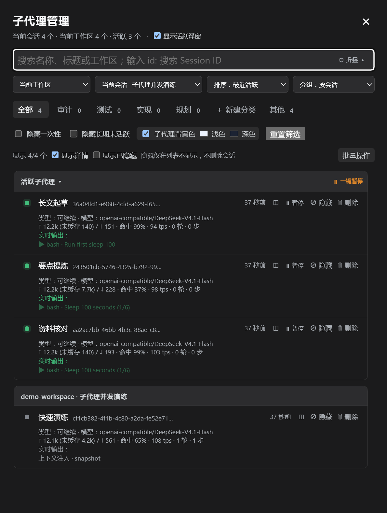
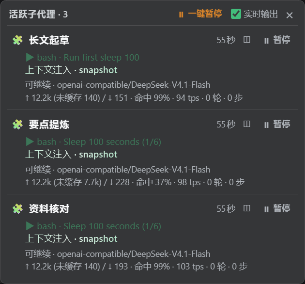

# DSH 子代理工作区管理器

面向 DeepSeek Harness Web 的子代理管理插件。插件在会话标题栏提供一个紧凑的 `🧩 子代理 active/total` 入口，用于搜索、筛选、分组、排序、查看和批量归档当前运行时已发现的子代理。

当前发布版本：**v1.1.1**

## 主要功能

### 会话与工作区范围

- 默认选择当前工作区。
- 默认选择当前主会话；即使当前页面已经进入某个子代理，会话管理器仍然以最上层主会话为基准。
- 工作区下拉框支持：
  - 当前工作区
  - 全部工作区
  - 具体工作区列表
- 会话下拉框支持：
  - 全部会话
  - 当前工作区内的会话
  - 当前会话标记
- 支持通过 `id:` 前缀单独搜索 Session ID，例如：

  ```text
  id: graph:g-a92e1406
  ```

  普通搜索不会把 Session ID 或父会话 ID 当作搜索字段。

### 搜索、排序与分组

- 普通搜索匹配子代理名称、标题和工作区名称。
- 支持按以下方式排序：
  - 最近活跃
  - 名字
  - 类型
- “最近活跃”优先使用 DSH 提供的 `updatedAt`。
- 最近进入运行状态的子代理会被记录，即使运行结束后仍会保持靠前显示。
- 支持以下分组：
  - 按会话
  - 按工作区
  - 按分类
  - 按类型
  - 不分组
- 按会话分组时，分组标题显示“工作区 · 会话名称”，卡片中不再重复显示相同的归属信息。
- 活跃子代理单独置顶，并可折叠。

## 界面截图

### 子代理管理抽屉



### 活跃子代理浮窗



### 分类标签

内置分类包括：

- 全部
- 其他
- 审计
- 测试
- 实现
- 规划

分类标签会显示当前数量，超过 99 个显示为 `99+`。

用户可以创建自定义正则分类。自定义分类支持：

- 标签内显示数量。
- 未选中时不显示选中高亮。
- 删除前确认。
- 删除按钮与分类名称处于同一个标签框内。

一次性子代理名称后显示紧凑标签：

```text
⚡ 一次性
```

可继续子代理不显示额外类型标签。

### 过滤与归档

支持以下过滤选项：

- 隐藏一次性
- 隐藏长期未活跃
- 显示已归档
- 重置筛选

归档是插件本地状态，只隐藏子代理，不会删除 DSH 会话或工作区文件。默认情况下：

- 列表不显示已归档子代理。
- 标题栏入口的总数和活跃数扣除已归档子代理。
- 勾选“隐藏一次性”后，入口按钮统计也会扣除一次性子代理。

### 批量操作

点击结果统计右侧的“批量操作”进入批量模式。批量模式下：

- 整张子代理卡片都变为选择区域。
- 点击卡片任意位置即可选中或取消选中。
- 复选框支持普通选择和 Shift 连续选择。
- 不会跳转到子代理会话。
- 隐藏单个“归档 / 解除归档”按钮。
- 已归档项显示 `已归档` 标签。
- “完成”按钮使用高亮样式，点击后退出批量模式。

可用批量操作：

- 全选当前筛选结果。
- 清空选择。
- 选择 N 小时以前的子代理。
- 批量归档。
- 批量解除归档。
- 一键归档当前筛选出的全部子代理。

“选择 N 小时以前”会刷新所有主会话的子代理目录，最多加载和选中 1000 个符合条件的子代理。

### 实时活动与流式输出

当 DSH 会话 API 提供绑定会话和对话快照时，卡片底部会显示实时活动：

- 最新两行模型文本或思考文本。
- 正在运行的工具调用，例如 `Read`、`Bash`。
- 最近完成的工具调用及成功/失败状态。
- 上下文注入，例如 `skill-catalog` 或插件系统提示。
- 命令状态。

实时输出具有金属光泽扫光动效；子代理结束后保留最后显示快照，并变为灰色。输出区域最多显示两行，避免持续滚动导致内容难以阅读。

## 界面说明

从上到下依次为：

1. **标题栏入口**：显示活跃数 / 总数，点击打开管理面板。
2. **搜索框**：普通文本搜索；使用 `id: xxx` 查询 Session ID。
3. **范围和排序行**：工作区、会话、排序、分组四个紧凑控件。
4. **分类标签行**：分类名称和数量。
5. **筛选行**：一次性、长期未活跃、已归档和重置筛选。
6. **结果统计**：显示当前结果数量和批量操作入口。
7. **结果列表**：活跃分组、会话/工作区分组、子代理卡片和实时状态。

插件不在左侧全局菜单增加入口按钮；入口仅位于会话标题栏。

## 安装

在插件目录执行：

```bash
dsh plugin --profile web add file:.
```

升级或重新安装时可以先移除旧版本：

```bash
dsh plugin --profile web remove dsh-subagent-workspace-ui
dsh plugin --profile web add file:.
```

插件 bundle 会自动加载 [`cordis.patch.yml`](cordis.patch.yml)：安装期间插入管理器，并禁用 DSH 自带的 `ui-subagent` 子代理导航。卸载插件后，该 bundle 层会移除，底层的 `ui-subagent` 设置自动恢复。请重启现有的 `dsh web` 进程，然后刷新：

```text
http://127.0.0.1:3080
```

如果之前在 `$DSH_HOME/profiles/web/cordis.patch.yml` 中手动禁用了 `ui-subagent`，测试自动恢复前请移除那条手动配置；插件不会覆盖用户自己的设置。

## 数据边界与兼容性

插件只管理当前 DSH Web 客户端运行时已经发现的子代理目录，不伪造不存在的历史数据。首次加载以 40 条为一页；普通分页可以继续加载，批量时间选择最多扩展到 1000 条。

公共 `SessionSummary` 不保证提供原始提示词、provider/model 或全部历史日志，因此插件不会查询或显示 provider/model。实时输出依赖公开的绑定会话接口：

```text
sessions.binding(childId).session
→ session.open()
→ session.getSnapshot().chat.legacy
```

如果宿主没有提供对应的对话快照，插件只能显示持久化的会话摘要和统计信息。

归档、分类和最近使用顺序保存在浏览器本地 `localStorage` 中，不会写入 DSH 会话日志。

## 开发与验证

插件的主要客户端实现位于 [`lib/client.js`](lib/client.js)，宿主入口位于 [`lib/index.js`](lib/index.js)。

执行语法检查：

```bash
pnpm run check
```

当前检查命令覆盖：

- `lib/client.js`
- `lib/index.js`

## v1.1.1 发布说明

- 测试脚本不再强制要求预先设置 API Key。
- 测试脚本根据自身位置定位项目目录，可从任意工作目录运行。

## v1.1.0 发布说明

- 增加右上角活跃子代理浮窗，显示运行时长、实时输出和统计信息。
- 支持在浮窗和管理抽屉中直接打断可取消的运行中子代理。
- 增加浮窗实时输出开关，关闭后可在有限空间显示更多子代理。
- 实时输出按 100ms 节流，并区分最新活动与已完成活动。
- 优先显示工具 description，长文件路径自动缩略。
- 增加 dsh-graph 工作流产生的大量子代理会话管理说明。

## v1.0.1 发布说明

- 增加中文文档。
- 完善当前主会话、工作区和会话选择逻辑。
- 增加规划分类和分类数量徽章。
- 增加批量选择、Shift 连选、时间范围选择和批量归档。
- 改进批量模式下的卡片交互和完成按钮视觉反馈。
- 增加活跃子代理置顶、实时工具调用、上下文注入和结束快照。
- 移除 provider/model 查询和显示。
- 移除左侧全局菜单中的子代理入口。
